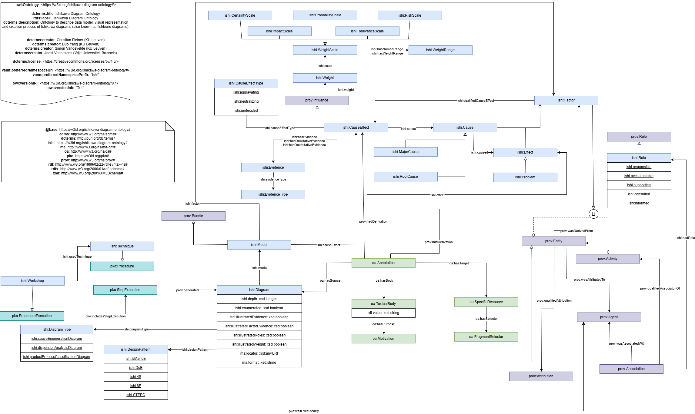

# Ishikawa Diagram Ontology

Repository for the Ishikawa Diagram Ontology and related modules.

| Prefix    | IRI |
| -- | ------- |
| ishi:  | [https://w3id.org/ishikawa-diagram-ontology#](https://w3id.org/ishikawa-diagram-ontology#)  |
| isdi:  | [https://w3id.org/ishikawa-diagram-ontology/ishikawa-diagramming/ishikawa-diagramming#](https://w3id.org/ishikawa-diagram-ontology/ishikawa-diagramming/ishikawa-diagramming#)  |

## Ontology purpose and scope

The Ishikawa ontology addresses the domain of Ishikawa diagrams which are one of the major tools for Root Cause Analysis (RCA) besides FMEA and Fault Tree Analysis.
Ishikawa diagrams are also known as fishbone or cause and effect diagrams (CED).
Ishikawa diagrams result from (iterative) workshops and are commonly stored as images which leads to ambiguous interpretations and a lack of machine-readability.
Thus, the ontology contains the relevant concepts to describe Ishikawa diagrams as visual artifacts, their encoded data model, and the process the diagrams resulted from according to best practices.

The purpose of the ontology is to model and describe an Ishikawa diagram as visual artifact, its encoded information, and its creation process.

The scope of this ontology is limited to Ishikawa diagrams and their identified best practices. Other tools for root cause analysis are not in scope of the ontology, but can be ontologically aligned. The same also applies for the multitude of techniques which can be used for Ishikawa diagramming, but are not explicitly contained in the core ontology.

The ontology reuses existing ontologies, including the [Web Annotation Ontology](http://www.w3.org/ns/oa#), [PROV-O](https://www.w3.org/TR/prov-o/), and [Procedural Knowledge Ontology](https://w3id.org/pko#).
For designing the ontology, we adopted the [Linked Open Terms (LOT) methodology](https://zenodo.org/records/2539305). 

The intended use of terms is detailed in the [diagram](./ishikawa-diagram-ontology/media/ishikawa-diagram-ontology.png), which uses the [Chowlk notation]( https://chowlk.linkeddata.es/notation):

## Use Cases

### Use Case A: Keeping knowledge explicit 

Ishikawa diagrams are visual representations that summarize cause and effect relationship to serve as basis for formulating actions to resolve the problem under investigation. Ishikawa diagrams are often pruned with factor descriptions kept short to provide a concise summary, leading to loss of information and potential misinterpretations. As a solution, the data model should contain additional information like explicit factor definitions or the importance of a relationship, which is not always shown in the diagram directly to maintain readability. After all, a diagram is a visual representation of a subset of the data model.

### Use Case B: Disclosing the dynamic knowledge space 
Ishikawa diagrams are commonly developed over multiple workshop sessions where the participating group is only a fraction of the workforce, which might lead to an incomplete knowledge space. Additionally, false or outdated knowledge could be captured. As a solution, data models and the activities they have resulted from are captured. This enables the back-tracking of the introduction or removal of factors and relationships. In a broader sense, Ishikawa diagrams can be also used in this manner to measure the effectiveness of trainings.

### Use Case C: Referencing responsibilities The formulation of problem-resolving
actions includes the assignment of responsibilities which should be derivable from the Ishikawa diagram. The ontology should incorporate means to describe and easily reference responsibilities or roles.

## Content of the repository

The RDF files describing the different versions of the ontology and its modules can be found in the folder [ishikawa-diagram-ontology](./ishikawa-diagram-ontology).

The repository was created using the [Cefriel Ontology Template](https://github.com/cefriel/ontology-template).
The ontology documentation and versioning is done using the Widoco tool.